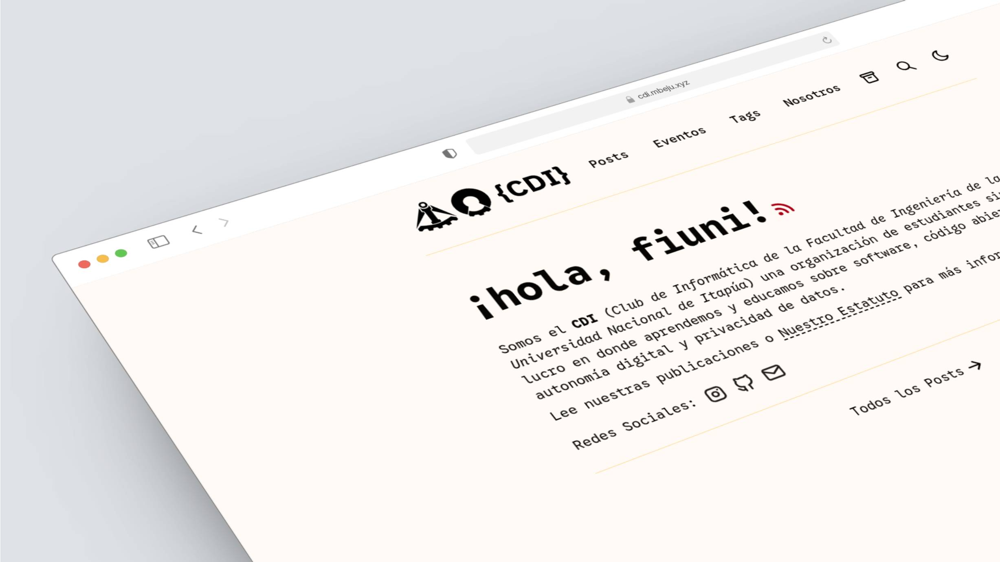

# CDI WEB 📄



# CDI WEB 📄

Este es un blog en Astro minimalista, adaptable (responsive), accesible y optimizado para SEO para el "Club de Informática de la FIUNI", basado en [AstroPaper](https://github.com/satnaing/astro-paper).

Leé [las publicaciones del blog](https://cdi.mbeju.xyz/posts/) o revisá [la sección de documentación del README](https://www.google.com/search?q=%23-documentation) para más info.

## 🔥 Características

- [x] Markdown seguro con tipos (type-safe)
- [x] Rendimiento súper rápido
- [x] Accesible (Teclado/VoiceOver)
- [x] Adaptable (móviles ~ computadoras de escritorio)
- [x] Optimizado para SEO
- [x] Modo claro y oscuro
- [x] Búsqueda estática ([Pagefind](https://pagefind.app/))
- [x] Borradores de publicaciones y paginación
- [x] Sitemap y feed RSS
- [x] Soporte para MDX
- [x] Tabla de contenidos colapsable
- [x] Buenas prácticas seguidas
- [x] Altamente personalizable
- [x] Generación dinámica de imágenes OG para publicaciones del blog ([Publicación del blog](https://cdi.mbeju.xyz/posts/dynamic-og-image-generation-in-CDI WEB-blog-posts/))
- [x] Preparado para i18n (internacionalización)

## 🚀 Estructura del proyecto

Dentro de CDI WEB, vas a ver las siguientes carpetas y archivos:

```bash
/
├── public/
│   ├── pagefind/          # generado automáticamente en la compilación (build)
│   ├── favicon.svg
│   └── default-og.jpg
├── src/
│   ├── assets/
│   │   ├── icons/
│   │   └── images/
│   ├── components/
│   ├── content/
│   │   ├── pages/
│   │   │   └── about.md
│   │   └── posts/
│   │       └── some-blog-posts.md
│   ├── i18n/
│   ├── layouts/
│   ├── pages/
│   ├── scripts/
│   ├── styles/
│   ├── types/
│   ├── utils/
│   ├── config.ts
│   └── content.config.ts
├── astro-paper.config.ts  # configuraciones definidas por el usuario
└── astro.config.ts

```

Todas las publicaciones del blog se guardan en el directorio `src/content/posts/`. Podés organizar las publicaciones en subdirectorios - el nombre del subdirectorio pasa a formar parte de la URL de la publicación.

## 📖 Documentación

La documentación se puede leer en dos formatos: _markdown_ y _publicación del blog_.

- Configuración - [markdown](src/content/posts/how-to-configure-CDI WEB-theme.md) | [publicación del blog](https://cdi.mbeju.xyz/posts/how-to-configure-CDI WEB-theme/)
- Agregar publicaciones - [markdown](https://www.google.com/search?q=src/content/posts/adding-new-post.md) | [publicación del blog](https://cdi.mbeju.xyz/posts/adding-new-posts-in-CDI WEB-theme/)
- Personalizar esquemas de colores - [markdown](src/content/posts/customizing-CDI WEB-theme-color-schemes.md) | [publicación del blog](https://cdi.mbeju.xyz/posts/customizing-CDI WEB-theme-color-schemes/)
- Esquemas de colores predefinidos - [markdown](https://www.google.com/search?q=src/content/posts/predefined-color-schemes.md) | [publicación del blog](https://cdi.mbeju.xyz/posts/predefined-color-schemes/)

## 💻 Tecnologías (Tech Stack)

**Framework Principal** - [Astro](https://astro.build/)

**Verificación de tipos** - [TypeScript](https://www.typescriptlang.org/)

**Estilos** - [TailwindCSS](https://tailwindcss.com/)

**UI/UX** - [Archivo de diseño en Figma](https://www.figma.com/community/file/1356898632249991861)

**Búsqueda estática** - [Pagefind](https://pagefind.app/)

**Iconos** - [Tablers](https://tabler-icons.io/)

**Formato de código** - [Prettier](https://prettier.io/)

**Despliegue** - [Cloudflare Pages](https://pages.cloudflare.com/)

**Linting** - [ESLint](https://eslint.org)

**Imágenes OG dinámicas** - [Satori](https://github.com/vercel/satori) + [Sharp](https://sharp.pixelplumbing.com/) + [Astro Fonts](https://docs.astro.build/en/guides/fonts/)

## 👨🏻‍💻 Ejecución local

Podés empezar a usar este proyecto de forma local ejecutando el siguiente comando en el directorio que prefieras:

```bash
# pnpm
pnpm create astro@latest --template satnaing/astro-paper

# npm
npm create astro@latest -- --template satnaing/astro-paper

# yarn
yarn create astro --template satnaing/astro-paper

# bun
bun create astro@latest -- --template satnaing/astro-paper

```

Después, iniciá el proyecto ejecutando los siguientes comandos:

```bash
# instalá las dependencias si no lo hiciste en el paso anterior.
pnpm install

# iniciá la ejecución del proyecto
pnpm dev

```

## 🧞 Comandos

Todos los comandos se ejecutan desde la raíz del proyecto, en una terminal:

| Comando          | Acción                                                                                                                                              |
| ---------------- | --------------------------------------------------------------------------------------------------------------------------------------------------- |
| `pnpm install`   | Instala las dependencias                                                                                                                            |
| `pnpm dev`       | Inicia el servidor de desarrollo local en `localhost:4321`                                                                                          |
| `pnpm build`     | Verifica los tipos, compila el sitio, ejecuta la indexación de Pagefind y copia el índice a `public/pagefind/`                                      |
| `pnpm preview`   | Previsualiza tu compilación localmente antes de desplegar                                                                                           |
| `pnpm sync`      | Genera los tipos de TypeScript para todos los módulos de Astro. [Más información](https://docs.astro.build/en/reference/cli-reference/#astro-sync). |
| `pnpm astro ...` | Ejecuta comandos de la CLI como `astro add`, `astro check`                                                                                          |

## ✨ Comentarios y sugerencias

Si tenés alguna sugerencia o comentario, podés contactarme a través de [mi correo electrónico](mailto:adan.alvarez+cdiweb@fiuni.edu.py). Asimismo, sentite libre de abrir un _issue_ si encontrás errores o querés solicitar nuevas funcionalidades.

## 📜 Licencia

Bajo la Licencia MIT, Copyright © 2026

---

Modificado con 🤍 por [Adán Alvarez](https://github.com/geroxima/) para el CDI.
